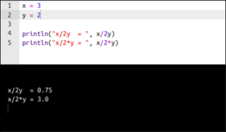

<!--
draft: true
-->

Every few months, it happens again. A post going viral on social media featuring an elementary math expression like this:

$$6 \div 2(1+2) \ ,$$

asking for the result of the operation, or showing the same old figure of two different Casio calculators.

 on Mathematics Stack Echange](casio.jpg){ #fig-casio fig-align="center" }

Cue thousands of comments, heated arguments, and friendships ending over whether the answer is **1** or **9**. Creators *love* this topic. It’s the ultimate engagement engine because the barrier to entry is non-existent—it only involves basic arithmetic—yet it makes everyone feel like a genius defending their camp.

Let's put it down clearly: **this isn't a math problem.** It's a math expression that may lead to **wrong reading** of the expression (or at most an **ambiguous expression**, for those who believe in juxtaposition) disguised as a puzzle.

And even more clearer: I'm sure you can use your time in many other more productive and/or more entertaining activities, or just have a relaxing walk or nap.

<!--
IMHO, the golden rule should be on one side **just write unambiguous contents**, being them articles, software, documentation; on the other side just avoiding this kind of traps, brand them and the creators as click-baiters 
-->

## The Trap: Juxtaposition vs. Strict Serial Logic

The entire "debate" relies on a clash of conventions regarding **implicit multiplication** (multiplication by juxtaposition, or simply putting terms side-by-side without a $\times$ or $\cdot$ operator).

* **The commonly accepted rule (standard [PEMDAS/BODMAS](https://en.wikipedia.org/wiki/Order_of_operations#mnemonics))** This is the priority rule we learned in school: in absence of parentheses, first 1) power and exponents, then 2) multiplication and division, and finally 3) addition and subraction. There's no priority within operations of the same group, and left-to-right priority between neighboring operations of the same group. If you follow this rule, multiplication and division have equal priority. You resolve the parentheses first $(3)$, then divide $6$ by $2$, and finally multiply the results:

    $$6 \div 2 \times 3 = 9$$

* **The juxtaposition view (IMF, Implicit Multiplication First)** *unfortunately*, some textbooks, (sloppy) scientists, and "content creators" treat a juxtaposed term like $2(3)$ as a single, tightly bound monomial. In their view, the juxtaposition acts as an invisible glue, giving it higher priority than explicit division, $6 \div 6 = 1$

Because there is no international treaty or international standard governing the "priority of juxtaposition", both sides can dig their heels into different manual rules, software environments, or calculator firmware versions. 

## The Golden Rule: if it's ambiguous, it's garbage

In professional mathematics, numerical simulation, and software engineering, **unambiguous clarity is the ultimate standard.** If an expression requires a debate among the target audience, the notation has failed. Full stop. I'm sure you can use unambiguous alternatives: just use them, to avoid losing time and patience later.

<!--
* **Python / C++:** Wisely treat this as illegal syntax. Writing `2(1+2)` throws a compiler error. You *must* write `2 * (1 + 2)`. Zero room for interpretation.
* **The Internet:** Exploits the ambiguity to generate millions of angry clicks.
-->

## So, what are we talking about?

This short post deals with juxtaposition, because some calculators and some programming languages rely on this **deprecated** - as it's ambiguous - priority rule. 

* **Casio calculators:** as already shown in the (in)famous picture @fig-casio, different models of Casio calculators use different "conventions"
* **Julia:** allows implicit multiplication and applies IMF priority view, as shown in @fig-julia

{ #fig-julia fig-align="center" }

## The Solution

It's good to know that this evil exists. We also know that we could meet some evil people in our life, that may use it. But **once we know it, just don't use it**, and use the golden standard rule: whenever you're in doubt, **use unambiguous expressions**. The use of some parenthesis or sign is not that effort!

Relying on the juxtaposition shortcut - across different programming environments or not -, beside its large potential of code ambiguity, behaves exactly like a **silent bug waiting to happen**.

I don't want to argue with anyone about PEMDAS for any reason, and you should not either.

<!--
$$\frac{6}{2}(1+2) = 9 \quad \text{vs.} \quad \frac{6}{2(1+2)} = 1$$
-->

I've already spent too much words and time on this post. I'll leave you this citation from [themathdoctors](https://www.themathdoctors.org/implied-multiplication-2-is-there-a-standard/).

The next time you see one of these posts clogging your feed, don't comment, don't choose a side, and don't feed the engagement algorithm. Maybe block the creator, if you smell the logic of click-baiting: just do not confuse math/logic tests with bad contents; just don't lose your time, patience and energy after them; just claim higher quality. It's **a matter of hygiene**.

> Since there are different opinions in reputable sources, and no one authoritative source, the best I can do is to point out the ambiguity and recommend avoidance, which is what I’ve been doing for 25 years.
>
> The only people who insist on writing such expressions, in my experience, are Internet trolls who want to start arguments. I choose not to join them, nor to agree with people who predict catastrophe if this isn’t fully resolved. This simply isn’t that important.
> -- <cite> </cite>

## References

* ["Implied multiplication" operator precedence?", *Mathematics Stack Exchange*](https://math.stackexchange.com/questions/3231556/implied-multiplication-operator-precedence).
* ["Implied Multiplication - part 2: Is There a Standard?", *the math doctors*](https://www.themathdoctors.org/implied-multiplication-2-is-there-a-standard/).
